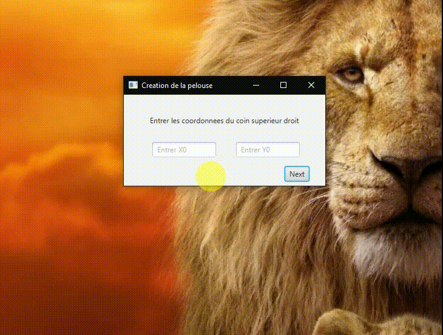

# NzhinuSoft Test

J'ai réalisé cette dans le cadre de l'entretien technique pour le stage à [ GOHZE](https://gohze.org/) une entreprise de la place qui fournie des services numériques. La logique et les spécifications sont présentées dans ce [doc](specifications/cmr_entretien_technique_tondeuse.pdf). Il nous a été demandé d'implémenter cela en 24 heures et en Java 11 ( et non en Python comme dans le doc ).
## Demo
